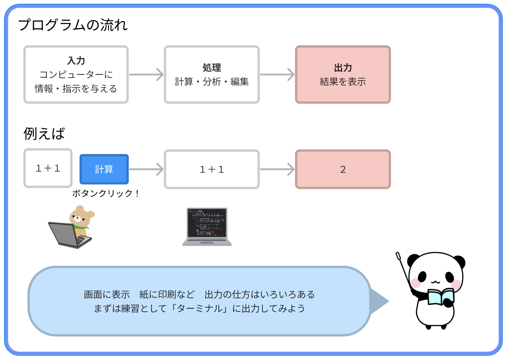

# **01_出力（print）**

## **プログラムを実行してみよう！**



## **基本のコード**

必ず、次のコードを書いてあげよう  
※HTMLの `<html>` タグのようなもの

```dart
void main() {
  
}
```

<br>

## **コメントアウト**

手前に「//」を入れると、記述を無効化できる  
<br>
**ショートカットキー**
- Windows：Ctrl + /
- Mac：Cmd + /

```dart
void main() {
  // ここに実行するコードを書く
}
```

<br>

## **文字の出力**

出力は `print()` で行う  

```dart
void main() {
  print('Hello');
}
```

```
>> Hello
```

**ポイント**  
- 文字は `'` (シングルクォーテーション)(Shift + 7 で出る)で囲う
- 最後に必ず `;` (セミコロン) を打つ
- 空白、改行、記号は、必ず見本に合わせる


<br>

## **数字の出力・計算**

```dart
void main() {
  print(1 + 2);
}
```
```
>> 3
```

**ポイント**  
- **計算**したい**数字**などは、`'`をつけずに**そのまま書く**
- `+` ⇨ 足し算。例：1 + 2 >> 3
- `-` ⇨ 引き算。例：3 - 1 >> 2
- `*` ⇨ 掛け算。例：3 * 2 >> 6
- `/` ⇨ 割り算 小数点アリ。例：3 / 2 >> 1.5
- `~/`  ⇨ 割り算 小数点切り捨て。例：3 ~/ 2 >> 1
- `%` ⇨ 割り算をしたあまり。例：5 % 3 >> 2

<br>

# **確認問題**

## **問題①**
`print()`を使って、出力結果が次のようになるプログラムを書こう

```
>> こんにちは
```

<br>

## **問題②**
`print()`を使って  
`2 * 3 + 4`  
と  
`2 * (3 + 4)`  
をプログラムでそれぞれ計算し、結果を出力しよう。  
どんな違いがあるかな？

<br>

## **問題③**

`print()`を使って、出力結果が **5** になる計算プログラムを **3つ** 書こう  
例：`print(5 + 0);`

```
>> 5
>> 5
>> 5
```