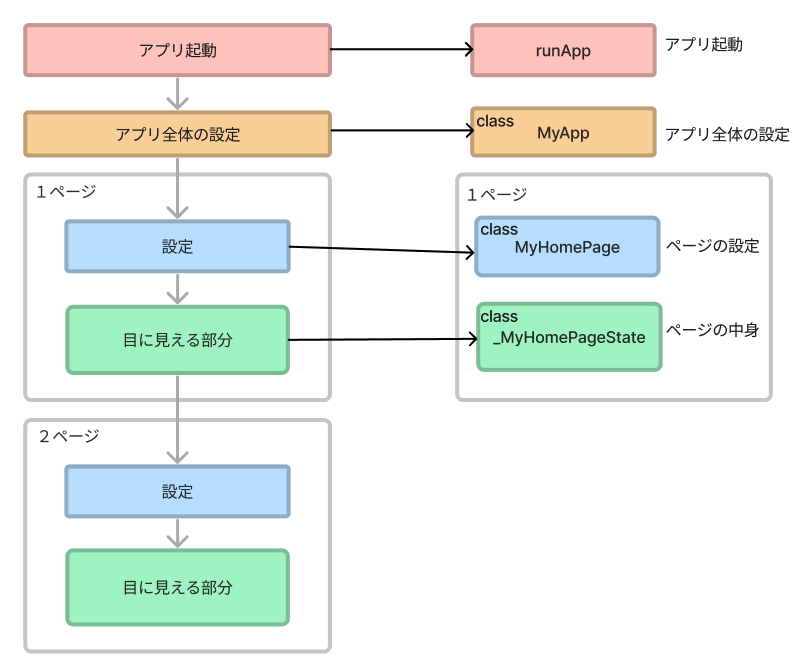
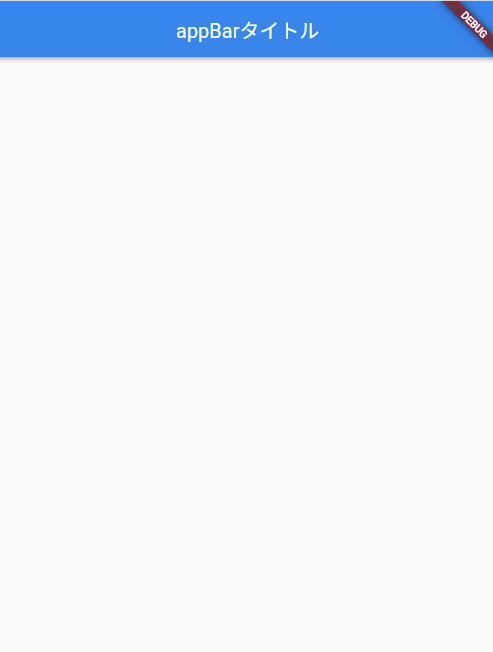
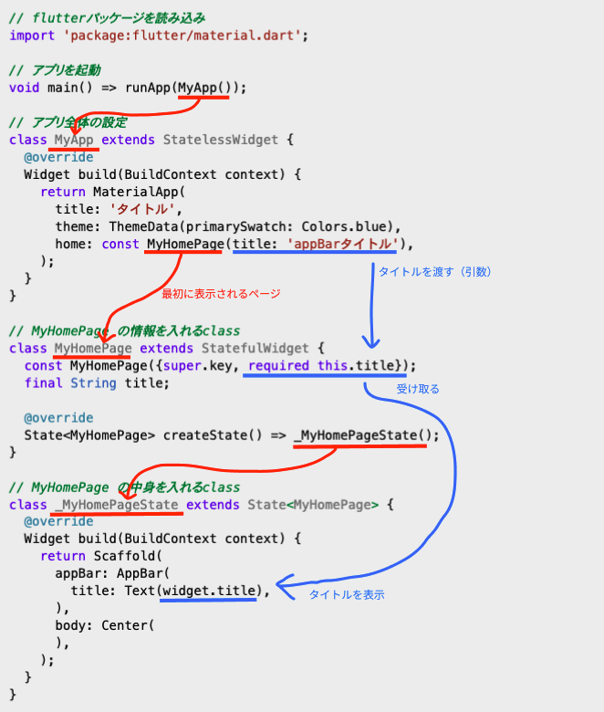

# **00_自己紹介アプリを作ろう**

widget（ウェジット）の練習として「自己紹介アプリ」を作ります。  
サンプルアプリを動かしてみよう。  
２ページ目は自由制作課題です。

<br>
右クリック＞新しいタブで開く  
https://webgakushu.com/flutter/profile/

<br>

## **プロジェクトを作る（復習）**

- VSCode>左下の歯車マーク＞コマンドパレット
- 検索＞flutterと入力＞「Flutter:New Project」＞「Application」
- 保存先を指定　src>projects
- アプリケーションの名前を「profile」に変更
- プロジェクトの完成
- lib>main.dartの中を全て削除　「Ctrl+A」の後、「backspace」

<br>

## **プロジェクトの構成**




### **`classは役割をもった処理のまとまり（関数に近い）`**

<br>

## **演習**  

①ソースコードをコピーしてmain.dartに貼り付け、ベースを作る  
②上の図と①で貼り付けたコードを照らし合わせて構成を把握する  
③アプリタイトルを設定  
④上のバー（appBar）に表示させるタイトルを設定  
⑤全体をCenterで中央揃えに  
⑥実行してアプリを立ち上げる  

<br><br>

### **【ソースコード】**

```dart
// flutterパッケージを読み込み
import 'package:flutter/material.dart';

// アプリを起動
void main() => runApp(MyApp());

// アプリ全体の設定
class MyApp extends StatelessWidget {
  @override
  Widget build(BuildContext context) {
    return MaterialApp(
      //③アプリタイトルを設定
      title: 'タイトル',
      theme: ThemeData(primarySwatch: Colors.blue),
      //④上のバー（appBar）に表示させるタイトルを設定
      home: const MyHomePage(title: 'appBarタイトル'),
    );
  }
}

// ページの設定
class MyHomePage extends StatefulWidget {
  const MyHomePage({super.key, required this.title});
  final String title;

  @override
  State<MyHomePage> createState() => _MyHomePageState();
}

// ページの中身を入れるclass
class _MyHomePageState extends State<MyHomePage> {
  @override
  Widget build(BuildContext context) {
    return Scaffold(
      appBar: AppBar(
        title: Text(widget.title),
      ),
      body: Center(
        //⑤全体をCenterで中央揃えに
        //アプリの見た目の部分 
      ),
    );
  }
}

```

## **実行の仕方（復習）**  

- VSCode右下「No Device」をクリック （すでに実行している場合は「Chrome」などになっている）
- 上部で「Chrome」を選択
- 左側の上から４つ目のアイコン（▶︎に虫）をクリック
- 実行とデバックをクリック

<br>

## **実行結果**



<br>

### **`コーディング→実行→確認の繰り返しで少しずつ覚えていきましょう！`**
### **`難しいコードがたくさん出てきましたが今は全て理解できていなくても大丈夫です`**

<br>

## **詳しいコードの説明**



<br>

### **解説の部分は軽く読んでおく程度で大丈夫です**
### **ここでは`それぞれのclassに役割がある`ことだけ覚えておきましょう**

<br>

(1) `import`でファイル内で使用するパッケージやファイルを読み込み  
```dart

import 'package:flutter/material.dart';

```

解説
- HTML/CSSの`<head>`タグの`<link rel="">`や`<link href="">`の役割
- `material.dart`は画面を構成する部品（widget）が含まれたファイル

<br>

(2) main.dartを実行すると一番最初に呼び出される部分  

```dart

void main() => runApp(MyApp());

```

解説
- 後続のclassで画面を組み立てて、`runApp`の引数（括弧の中身）に設定、最後に`runApp`が実行されることでアプリ画面が表示される

<br>

(3) アプリ全体の設定

```dart

class MyApp extends StatelessWidget {
  @override
  Widget build(BuildContext context) {
    return MaterialApp(
      title: 'タイトル',
      theme: ThemeData(primarySwatch: Colors.blue),
      home: const MyHomePage(title: 'appBarタイトル'),
    );
  }
}

```

解説
- `StatelessWidget`:(4)で説明します
- `MaterialApp`:マテリアルデザインに準拠した部品(widget)を提供してくれる
- `title`:ブラウザ（chromeなど）で実行したとき、タブの部分　HTMLの`<title>`と同じ
- `theme`:アプリ全体のデザインの指定　アプリ全体の色
- `home`:最初に表示させるページを指定
- `マテリアルデザインとは`:Googleが提唱しているデザインの考え方 「見やすく、直感的に操作できるWebページ・サービス」を作ることを目的としている  
例えば、ボタンに影がついていたり、スワイプでページを変えるときにめくっているような感じがあったり現実世界に近い感覚で操作ができるデザイン　`MaterialApp`を指定することで簡単に実装できます。詳しく知りたい人は「マテリアルデザインとは」で検索してみよう。

<br>

(4) １ページ目の設定
```dart

class MyHomePage extends StatefulWidget {
  const MyHomePage({super.key, required this.title});
  final String title;

  @override
  State<MyHomePage> createState() => _MyHomePageState();
}

```

解説
- `StatelessWidget`と`StatefulWidget`:状態を保つか持たないか  
  ページ内でデータ計算や編集をするかどうかで使い分けるとよいでしょう  
  `StatelessWidget`: 計算や編集を行わない  
  `StatefulWidget`: 計算や編集を行う  
  `MyApp`classは最初のページを表示するだけなので`StatelessWidget`、１ページ目からはデータを扱って計算や編集を行うので`StatefulWidget`
- `{super.key, required this.title}`:データを引き継ぐ（次のクイズアプリで詳しく説明します）
- `@override`:前に出てきたclassの機能を引き継ぐ（おまじないみたいなもの、書いておけば大丈夫）  

<br>

(5) １ページ目 見た目の部分
```dart

class _MyHomePageState extends State<MyHomePage> {
  @override
  Widget build(BuildContext context) {
    return Scaffold(
      appBar: AppBar(
        title: Text(widget.title),
      ),
      body: Center(
        //⑤全体をCenterで中央揃えに
        //アプリの見た目の部分 
      ),
    );
  }
}

```

解説

- `Scaffold`:ページのベースを作る　マテリアルデザインのアプリをつくる場合に必要
- `appBar`:画面上部のバーの部分の設定
- `body`:ページの中身を作る部分
