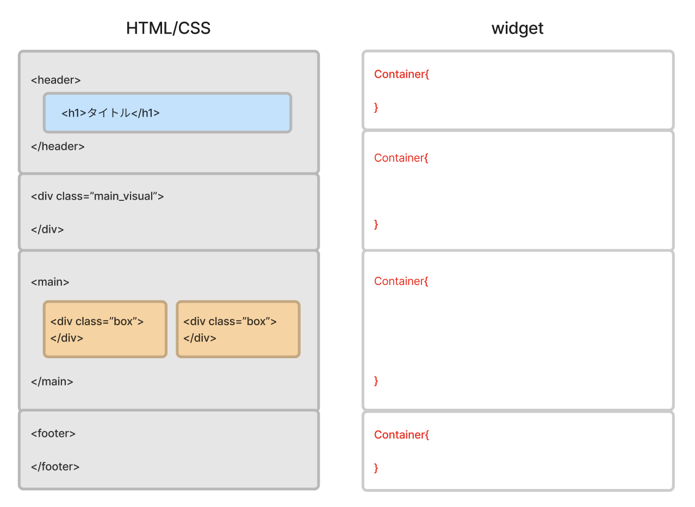
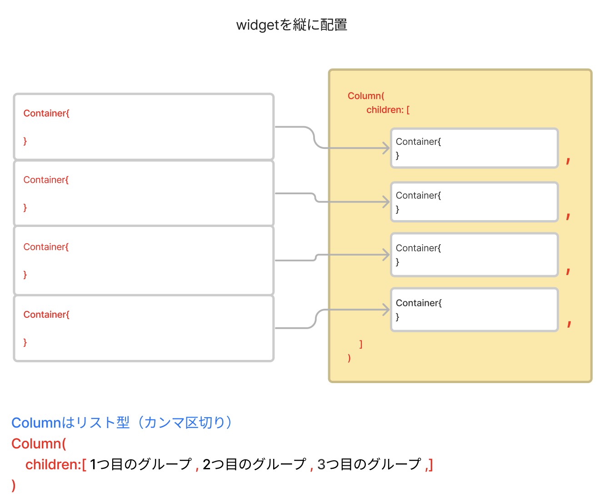
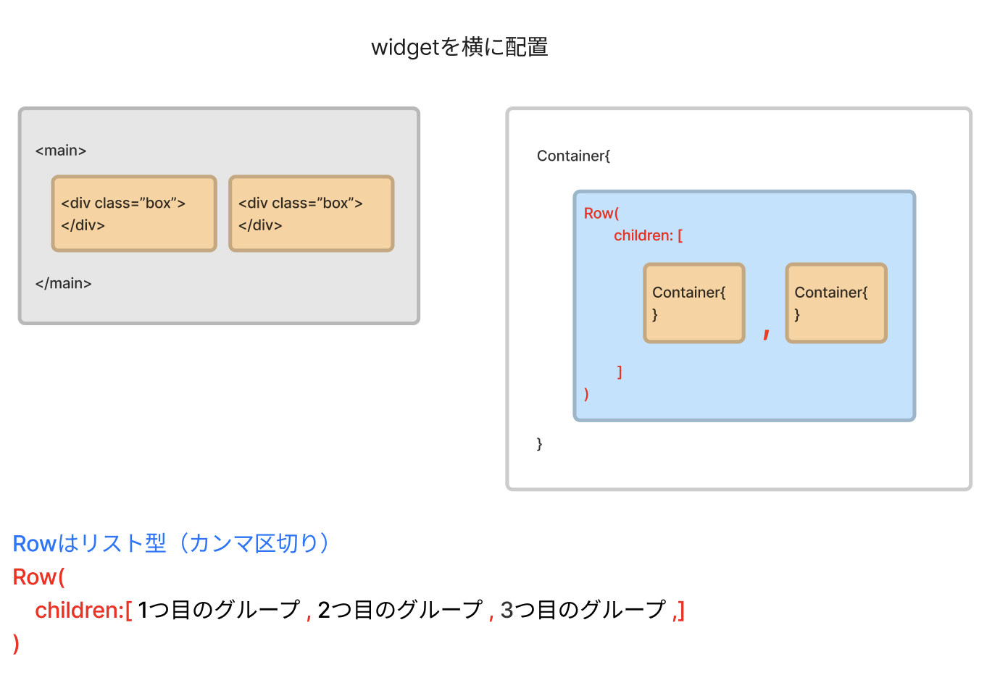
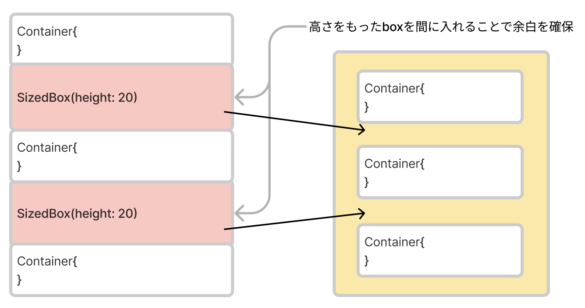
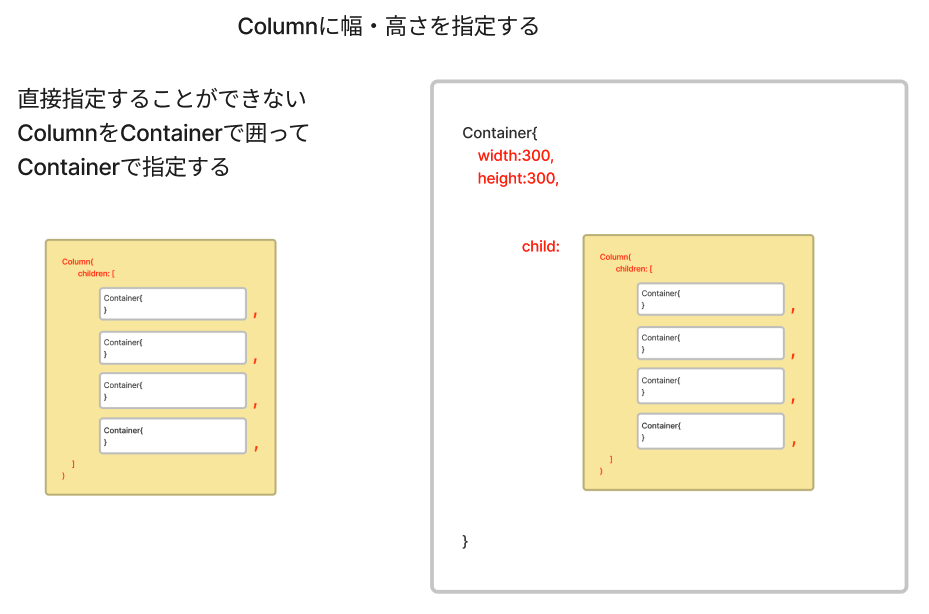
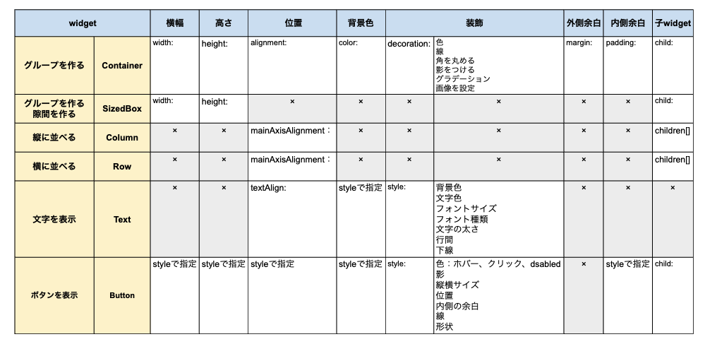

# **01_widgetの基本**

## **widgetを追加してみよう**

Widget（ウェジット）はFlutterのUIを構築しているパーツです。   
様々なWidgetを組み合わせることで複雑なUIを構築します。

 

※UI「User Interface（ユーザーインターフェイス）」・・・ユーザーとコンピューターあいだで情報をやり取りするさまざまな機器や入力装置を指します。  
アプリのUIは、ボタン、入力フォーム、画像や文字、デザインなど画面に表示されるもの全般になります。

  

## **最初におさえておこう！（html/cssとwidgetの比較）**

- グループは「Container」
- 親子関係は「child:」
- 縦に並べるには「Column children」
- 横に並べるには「Row children」
- 間の余白は「SizedBox」
- 横幅・高さを指定できるのは「Container」「SizedBox」

 

### **①「Container」（レイアウト/グループを作るwidget）**  

HTMLでグループを作るタグには`<header><nav><main><footer>
`などがありました。  
flutterでは`Container`widgetを使ってグループを作ります。

****

  

### **②「child:」widgetの中にwidgetを入れる（親子関係）**

widgetの中にwidgetを入れる場合は、中に入れる子のwidgetの前に`child:`をつけます。

  

### **③「Column」widgetを縦に並べる**

HTMLではタグを順番に書くだけで縦に配置できました。  
flutterでは`Column` widgetで囲う必要があります。

  

### **④「Row」widgetを横に並べる**

HTMLではCSSで「display:flex;」や「display:grid;」を使いました。  
flutterでは`Row` widgetを使います。

  

### **⑤「SizedBox」widgetとwidgetに余白を入れる** 

CSSの`margin`のような役割をしてくれるwidgetです

  

### **⑥「width」幅、「height」高さの指定（指定できるwidgetは限られている！）**

HTML/CSSではタグやクラス名を指定して幅・高さをつけることができました。  
flutterでは指定できるwidgetが限られています。  
例えば`Column`で縦に並べたwidgetに横幅・高さを指定したい場合、`Column`に直接指定することはできません。  

  

  

### **⑦widgetプロパティーまとめ**

これからの演習でよく使うWidgetに指定できるプロパティ（状態・属性）をまとめています。  
「Column」「Row」のように`幅の指定やスタイルの指定ができないwidgetは「Container」で囲う`と覚えておきましょう。  
詳しい書き方はこれからの演習で勉強していきます。  

  

  
