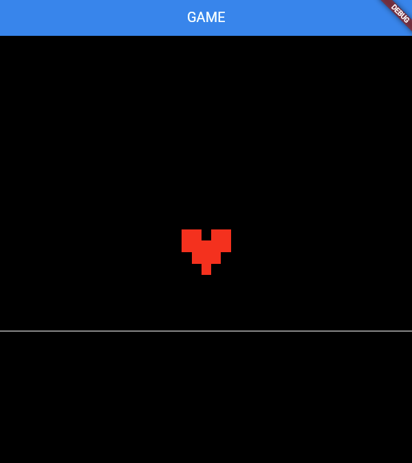
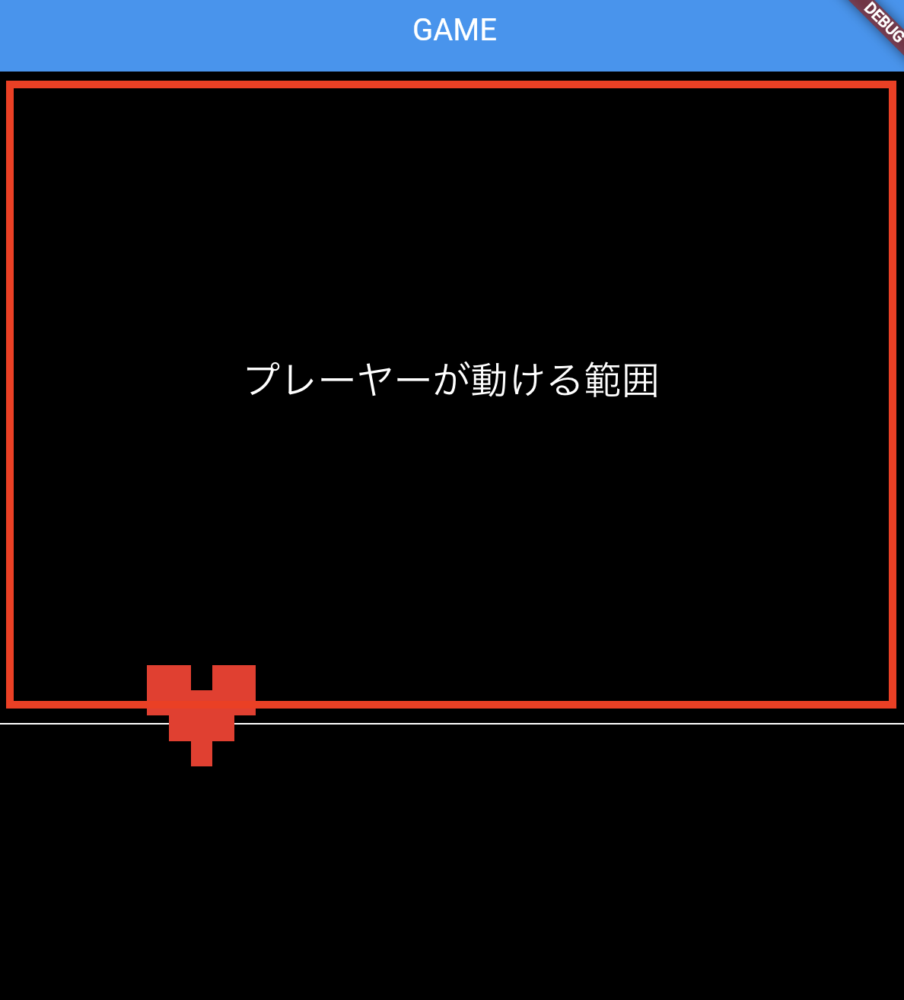

# **プレーヤーの表示**

## **geme.dart**

### **プレイヤーのクラスを呼び出す**

①スクリーンの情報取得  
②プレイヤー描画  
③プレーヤーのプログラム追加

```dart

//③プレーヤーのプログラム追加
import 'mysprite.dart';

class MainGame extends FlameGame {
  @override
  // --- 初期化 ---
  Future<void> onLoad() async {
    await super.onLoad();

    await add(RectangleComponent(
      position: Vector2(0, size.y - 200),
      size: Vector2(size.x, 1),
    ));

    // ①スクリーンの情報取得
    await add(ScreenHitbox());

    // ②プレイヤー描画
    MySpriteRemove();
  }

  // ②プレイヤー描画(mysprit.dartのMySpriteクラスを呼び出す)
  Future<void> MySpriteRemove() async {
    await add(MySprite());
  }
}


```

## **mysprit.dart**



<br>

①スプライトの準備

`assets`フォルダを作成、その中に`images`フォルダを作成

<br>

【pubspec.yaml】
```dart

assets:
    - assets/images/

```

<br>

②スプライトの表示

```dart

import 'package:flame/components.dart';
import 'game.dart';

//プレイヤーの動きを作るクラス（SpriteComponent）
//---------------------------------------------------------------
class MySprite extends SpriteComponent with HasGameRef<MainGame> {
  @override
  Future<void> onLoad() async {
    //画像取得（描画の場所とサイズ指定）
    sprite = await Sprite.load('heart.png');
    position = Vector2(gameRef.size.x * 0.5, gameRef.size.y * 0.5);
    size = Vector2(100, 100);
    anchor = Anchor.center;   //スプライトの真ん中を中心とする

    await super.onLoad();
  }
}

```

**SpriteComponent**

画像を表示するためのwidget

<br>

**game.dartのMainGameクラスの情報を扱えるようにする**

```dart

with HasGameRef<MainGame>

```

<br>

**gameRefをつける**

game.dartのMainGameクラスの情報を使う場合は`gameRef.`をつける
フィールドの横幅、高さは`FlameGame`widgetに含まれる

```dart

gameRef.size.x
gameRef.size.y

```

<br>

## **プレーヤーを動かす（キーボード操作）**

**game.dart**

①パッケージ追加

```dart

import 'package:flame/input.dart';

```

②`HasKeyboardHandlerComponents`を追加

```dart

class MainGame extends FlameGame with HasKeyboardHandlerComponents {

```

【game.dart】

```dart

import 'package:flame/game.dart';
import 'package:flame/input.dart';
import 'package:flame/components.dart';

import 'mysprite.dart';

//ゲーム全体の動きを作る（メインのクラス）
class MainGame extends FlameGame with HasKeyboardHandlerComponents {
  @override
  // --- 初期化 ---
  Future<void> onLoad() async {
    await super.onLoad();

    // スクリーンに線を引く
    await add(RectangleComponent(
      position: Vector2(0, size.y - 200),
      size: Vector2(size.x, 1),
    ));

    // スクリーンの情報取得
    await add(ScreenHitbox());

    // プレイヤー描画
    MySpriteRemove();
  }

  // プレイヤー描画(mysprit.dartのMySpriteクラスを呼び出す)
  Future<void> MySpriteRemove() async {
    await add(MySprite());
  }
}

```

<br>

**mysprite.dart**

①パッケージ追加

```dart

import 'package:flutter/services.dart';

```

②`KeyboardHandler`を追加

```dart

class MySprite extends SpriteComponent with HasGameRef<MainGame>,KeyboardHandler {

```

③変数（移動量、スピード）

```dart

class MySprite extends SpriteComponent
    with HasGameRef<MainGame>, KeyboardHandler {

      late Vector2 _delta; //キーボード押した時の移動量
      double _speed = 500;

    //省略
```

④キーを検知して移動量追加

```dart

//キーボード操作
  @override
  bool onKeyEvent(
    RawKeyEvent event,
    Set<LogicalKeyboardKey> keysPressed,
  ) {
    //キーから離れたとき止まる
    if (event is RawKeyUpEvent) {
      _delta = Vector2.zero();
    }
    //[A]キーを押した時
    if (event.character == 'a') {
      _delta.x = -1;
    }
    if (event.character == 'd') {
      _delta.x = 1;
    }
    if (event.character == 'w') {
      _delta.y = -1;
    }
    if (event.character == 's') {
      _delta.y = 1;
    }
    return true;
  }

```

⑤読み込み

```dart

//スプライトの更新
@override
void update(double delta) {
  super.update(delta);

  //画面が読み込まれる毎にpositionを更新
  position += _delta * delta * _speed;
}

```

`delta`・・・PCのfps値、これを掛けることでPCのレートに合わせて動いてくれる  

<br>



<br>

⑥範囲内で移動

```dart

@override
  void update(double delta) {
    super.update(delta);

    position += _delta * delta * _speed;

    if (position.x < size.x / 2) {
      position.x = size.x / 2;
    }
    if (position.x > gameRef.size.x - size.x / 2) {
      position.x = gameRef.size.x - size.x / 2;
    }
    if (position.y < size.y / 2) {
      position.y = size.y / 2;
    }
    if (position.y > gameRef.size.y - size.y / 2 - 200) {
      position.y = gameRef.size.y - size.y / 2 - 200;
    }
  }

```

【ソースコード】

```dart

import 'package:flutter/services.dart';
import 'package:flame/components.dart';
import 'game.dart';

//プレイヤーの動きを作るクラス（SpriteComponent）
//---------------------------------------------------------------
//キーボードイベント処理追加（KeyboardHandlerをミックスイン）
class MySprite extends SpriteComponent
    with HasGameRef<MainGame>, KeyboardHandler {
  late Vector2 _delta; //キーボード押した時の移動量
  double _speed = 500;

  @override
  Future<void> onLoad() async {
    //画像取得（描画の場所とサイズ指定）
    sprite = await Sprite.load('heart.png');
    position = Vector2(gameRef.size.x * 0.5, gameRef.size.y * 0.5);
    size = Vector2(100, 100);
    anchor = Anchor.center;
    _delta = Vector2.zero();

    await super.onLoad();
  }

  //キーボード操作
  @override
  bool onKeyEvent(
    RawKeyEvent event,
    Set<LogicalKeyboardKey> keysPressed,
  ) {
    if (event is RawKeyUpEvent) {
      _delta = Vector2.zero();
    }
    if (event.character == 'a') {
      _delta.x = -1;
    }
    if (event.character == 'd') {
      _delta.x = 1;
    }
    if (event.character == 'w') {
      _delta.y = -1;
    }
    if (event.character == 's') {
      _delta.y = 1;
    }
    return true;
  }

  //スプライトの更新
  @override
  void update(double delta) {
    super.update(delta);

    position += _delta * delta * _speed;

    if (position.x < size.x / 2) {
      position.x = size.x / 2;
    }
    if (position.x > gameRef.size.x - size.x / 2) {
      position.x = gameRef.size.x - size.x / 2;
    }
    if (position.y < size.y / 2) {
      position.y = size.y / 2;
    }
    if (position.y > gameRef.size.y - size.y / 2 - 200) {
      position.y = gameRef.size.y - size.y / 2 - 200;
    }
  }
}

```
